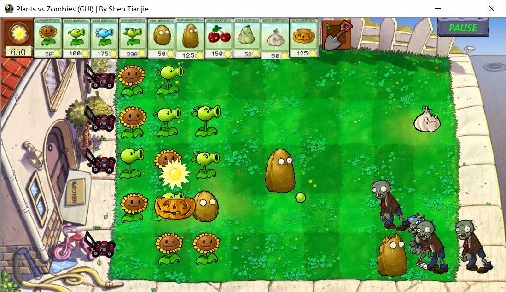
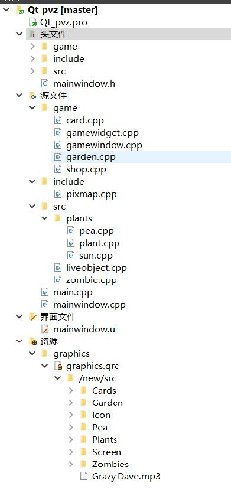

# 植物大战僵尸

使用了QT作为GUI框架，制作了具有一定可玩性的pvz课程设计。欢迎star。

## 运行平台

使用的操作系统为Windows10，开发平台为Qt5.8.0 + Qt Creator 4.2.1(Community)，编码方式为UTF-8

## 游戏背景

界面仿照原版植物大战僵尸，最上方是卡牌商店，商店右边是铲子，右上角是暂停继续按钮，界面中央是地图，植物和僵尸在此展开战斗，地图左边是小推车。
界面中的静态物体通过绘制PNG 图片实现，动态物体通过绘制GIF 图片的每一帧实现。

## 基本操作

点击游戏上方的卡牌选择植物拖动到草坪进行购买。点击铲子可以删除种植的植物。

# 代码结构

